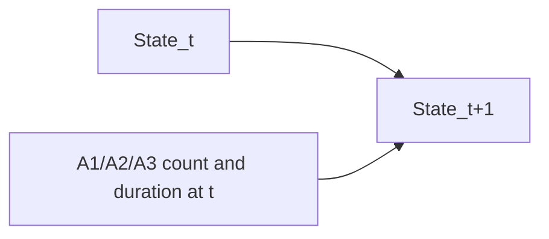
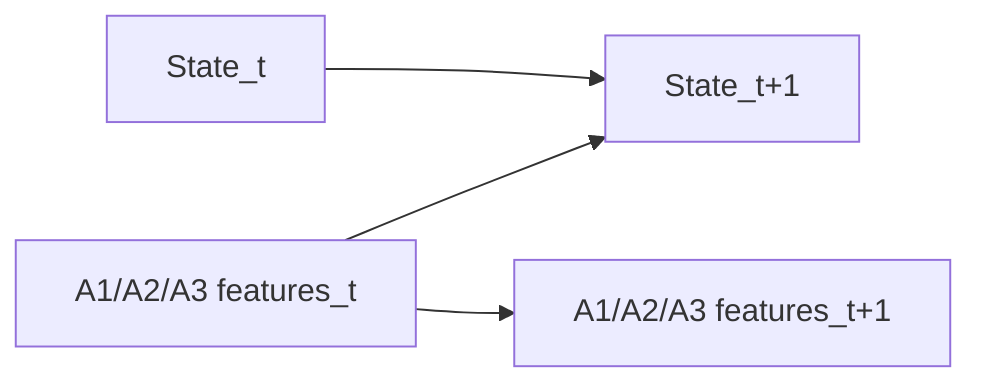
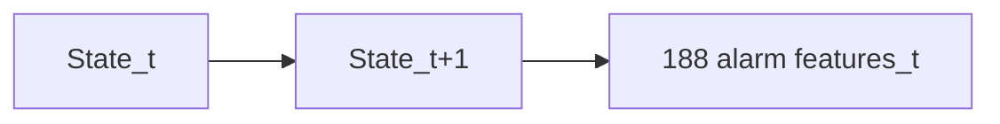
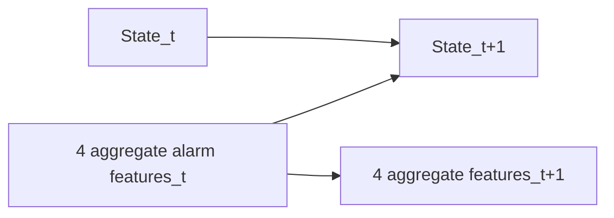

# DBN machine-failure prediction

This folder compares five Dynamic Bayesian Network variants for predicting the
next machine state from alarm activity:

`P(State(t+1) = Failure | State(t), alarm evidence at t)`

The reproducible comparison is in
`dbn_model_summary.ipynb`. It uses the same chronological 75%/25% split for
every model: 146 training transitions and 49 held-out transitions. The test
set is never used to estimate model parameters.

## Programs and structures

| Program | Alarm representation | Structure | Estimator |
|---|---|---|---|
| `dbn_failure_prediction.ipynb` | Three most frequent alarms, six features | Current state and alarm features point to the next state | BDeu |
| `dbn_alarm_data_prediction.ipynb` | Three most frequent alarms, six features | Genuine two-slice DBN | MLE |
| `dbn_failure_prediction_all_alarms.ipynb` | All 94 alarms, 188 features | Naive-Bayes conditional independence | BDeu |
| `dbn_alarm_data_prediction_all_alarms.ipynb` | All 94 alarms, 188 features | Naive-Bayes conditional independence | MLE |
| `dbn_fit_all_alarms_aggregated.ipynb` | All 94 alarms summarized into four features | Genuine two-slice DBN | MLE |

The all-alarm Naive-Bayes variants are necessary because a joint CPT for 188
categorical alarm variables is computationally infeasible. The aggregated
variant preserves a genuine DBN while trading alarm identity for tractability.

## Network visualizations and program descriptions

The diagrams below show the repeating two-slice pattern. Nodes with a `t`
suffix describe the current window; nodes with a `t+1` suffix describe the
next window. The arrows indicate the conditional dependencies used for
prediction, not necessarily physical causality.

### 1. `dbn_failure_prediction.ipynb` — top-3 alarms with BDeu



This program selects the three most frequent alarms and creates six categorical
features: count and duration for A1, A2, and A3. It fits a flat Bayesian
network equivalent to the displayed DBN, where the current state and all six
current-window alarm features jointly predict the next state. BDeu smoothing
adds prior probability to combinations that do not occur in the training
transitions. It is the most compact and best-performing model in the held-out
comparison.

### 2. `dbn_alarm_data_prediction.ipynb` — top-3 alarms with pure DBN MLE



This program uses the same three alarms and six features as program 1, but fits
a genuine `DynamicBayesianNetwork` with maximum likelihood estimation. The
feature self-edges keep both time slices represented for DBN inference, while
the current alarm features and current state feed the next state. MLE estimates
probabilities only from observed counts and does not smooth sparse or unseen
patterns, which makes this version more brittle on the held-out period.

### 3. `dbn_failure_prediction_all_alarms.ipynb` — all alarms with BDeu



This program represents all 94 alarm IDs using 188 categorical variables:
count and duration for every alarm. A single joint CPT would be too large, so
the model imposes a Naive-Bayes-style conditional-independence structure. The
next state is first predicted from the current state, and the alarm features
are modeled as conditionally independent children of the predicted state.
BDeu smoothing makes this high-dimensional sparse representation more stable
than plain MLE, although the many mostly inactive alarms can add noise.

### 4. `dbn_alarm_data_prediction_all_alarms.ipynb` — all alarms with MLE


This program has the same all-94 Naive-Bayes structure as program 3, but learns
all CPTs with maximum likelihood estimation. It therefore keeps the identity
and count/duration information of every alarm while avoiding an infeasible
joint CPT. The absence of smoothing makes it sensitive to rare combinations
and is the main difference from program 3.

### 5. `dbn_fit_all_alarms_aggregated.ipynb` — aggregated all-alarm pure DBN



This program keeps a genuine two-slice DBN but compresses all 94 alarms into
four window-level summaries: total alarm events, total alarm duration, number
of distinct active alarms, and maximum single-alarm duration. The summaries
make DBN fitting tractable, but they discard which particular alarm fired.
Consequently, different failure mechanisms can look identical to the model.
The model is trained with MLE.

### Structural comparison

Programs 1 and 2 use the same informative top-3 alarm evidence; their main
difference is BDeu smoothing versus unsmoothed MLE and a flat equivalent model
versus a genuine DBN implementation. Programs 3 and 4 use all alarms but make
the conditional-independence approximation; their main difference is again
BDeu versus MLE. Program 5 is the most compact genuine DBN, but it sacrifices
alarm identity through aggregation.

## Held-out results

Positive class: `Failure`. Persistence means predicting that the next state is
the current state.

| Model | Accuracy | Precision | Recall | F1 | TP | FP | FN | TN | Persistence |
|---|---:|---:|---:|---:|---:|---:|---:|---:|---:|
| Top-3 BDeu joint | 0.878 | 0.889 | 0.889 | **0.889** | 24 | 3 | 3 | 19 | 0.816 |
| Top-3 pure DBN MLE | 0.531 | 0.833 | 0.185 | 0.303 | 5 | 1 | 22 | 21 | 0.816 |
| All-94 BDeu Naive Bayes | 0.653 | 0.857 | 0.444 | 0.585 | 12 | 2 | 15 | 20 | 0.816 |
| All-94 MLE Naive Bayes | 0.531 | 0.700 | 0.259 | 0.378 | 7 | 3 | 20 | 19 | 0.816 |
| All-94 aggregated pure DBN MLE | 0.551 | 0.778 | 0.259 | 0.389 | 7 | 2 | 20 | 20 | 0.816 |

## Interpretation

The top-3 BDeu model is the best choice for unseen-data prediction. Its small,
informative feature set makes a joint CPT estimable, and BDeu smoothing prevents
unseen alarm combinations from producing brittle zero probabilities. It
outperforms the persistence baseline and catches 24 of 27 held-out failures.

The pure MLE models have no smoothing. Sparse alarm patterns in the test set
therefore lead to persistence-like predictions and low failure recall. The
all-94 models also add many mostly inactive alarm channels; under the
conditional-independence assumption, these weak signals accumulate noise.
Aggregating the 94 alarms makes a real DBN possible, but loses the identity of
the alarm that fired and consequently misses distinct failure mechanisms.

The in-sample scores printed by the original notebooks are useful for debugging
but must not be used to rank models. The held-out comparison in
`dbn_model_summary.ipynb` is the fair evaluation.

## Reproduce

```text
python -m venv .venv
.venv\Scripts\activate
pip install -r requirements.txt
jupyter lab
```
